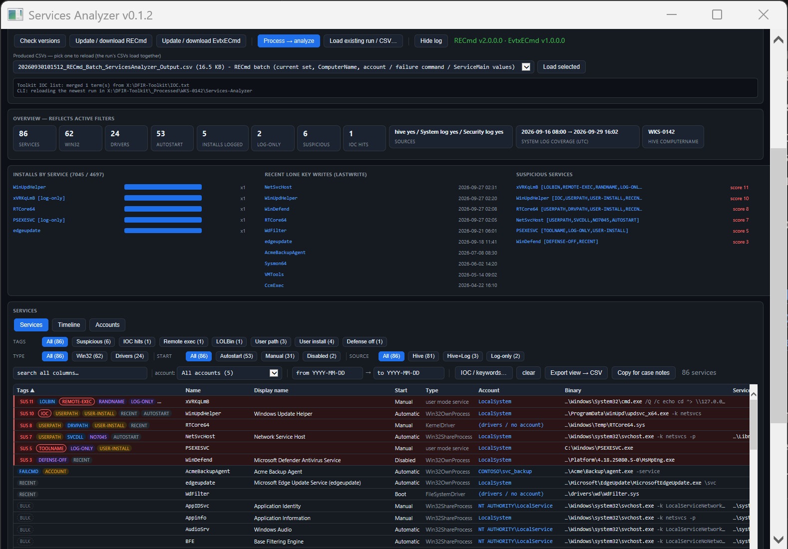
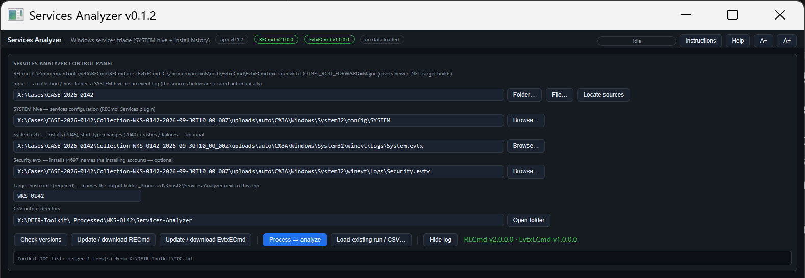
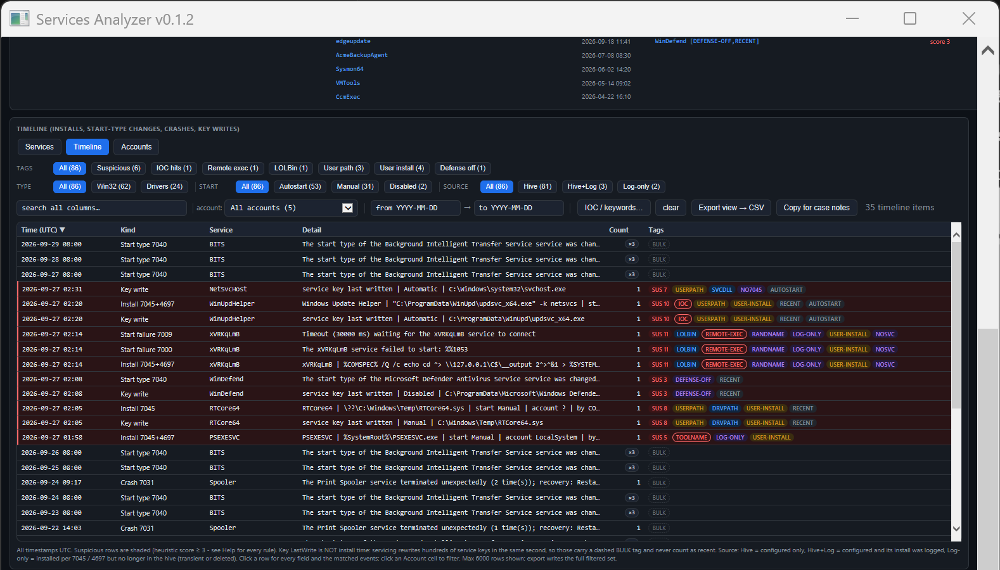
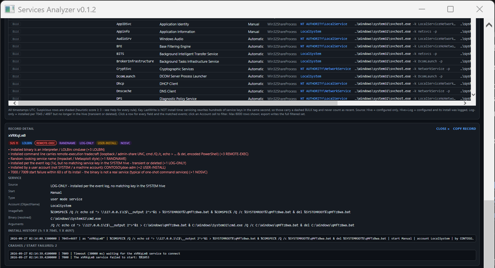

# Services-Analyzer

A single-file GUI for **Windows services triage**. It reads every service and driver the **SYSTEM hive** configures (Eric Zimmerman's [RECmd](https://github.com/EricZimmerman/RECmd), Services plugin), **joins** it to the install history in the **System** and **Security** event logs ([EvtxECmd](https://github.com/EricZimmerman/evtx): 7045 / 4697 installs, 7040 start-type changes, crashes and start failures), and scores every service for persistence and remote-execution tradecraft. One `.hta`, no install. Part of the [DFIR-Windows-Artifact-Finder](https://github.com/bpmorris22/DFIR-Windows-Artifact-Finder) toolkit.



> Screenshots use a synthetic host (`WKS-0142`, domain `CONTOSO`) with one planted intrusion — no real case data.

## Why the join matters

- **What is configured to run?** Binary, ServiceDLL, run-as account, start mode, recovery command and key LastWrite for every service and driver.
- **What was installed, when, and by whom?** 7045 / 4697 install events, with the installing account.
- **What was installed and is no longer there?** An install with no matching service key is a **transient or deleted service** — PsExec, Impacket `smbexec` / `psexec`, `sc create` one-shots. A registry-only tool never sees it; a log-only tool sees the install but not the configuration beside it. Here it sits in the same table, tagged `LOG-ONLY`.

## Quick start

1. Put `Services-Analyzer.hta` anywhere and double-click it. It needs a `RECmd` folder (exe + `Plugins\`, which holds the Services plugin) and, for the logs, an `EvtxECmd` folder (exe + `Maps\`) — next to the app or in `C:\ZimmermanTools`. **Update / download RECmd** / **EvtxECmd** fetch the official zips.
2. **Folder…** → a host's collection folder (Velociraptor / KAPE trees work as-is). The app finds `config\SYSTEM` and `winevt\Logs\System.evtx` / `Security.evtx` and fills the three source boxes; a single hive or `.evtx` works too.
3. Confirm the **Target hostname** guess, then **Process → analyze**. A typical host takes under a minute.



## Views

- **Services** — one row per service (current control set, plus services only in another set, plus services seen only in the logs), score-ranked, with chips for tags, type (Win32 / drivers), start mode and source (Hive / Hive+Log / Log-only), an account filter, search, a date window, IOC matching, CSV export and copy-for-case-notes.
- **Timeline** — installs, start-type changes (collapsed per service per day), crashes and start failures, lone key writes, and one row per bulk servicing rewrite.
- **Accounts** — services grouped by run-as account.
- **Detail pane** — every scoring reason, every field, the other control set's values, the full install history (with installer and what the join matched on), start-type changes and failures.





## Scoring

Rules add points; **score ≥ 3** is suspicious.

| Points | Rules |
|---|---|
| +3 | `IOC` hit · `USERPATH` (binary or ServiceDLL in a user-writable folder) · `LOLBIN` (cmd, powershell, mshta, rundll32, regsvr32, … as the service binary) · `REMOTE-EXEC` (loopback / admin-share UNC, `cmd /Q /c`, echo-redirect-delete chains, encoded PowerShell) |
| +2 | `TOOLNAME` (PSEXESVC, PAExec, RemCom, …) · `SVCDLL` (ServiceDLL outside system32 / Program Files) · `DRVPATH` (driver outside system32\drivers / DriverStore) · `DEFENSE-OFF` (Defender, firewall, Event Log, Sysmon … disabled) · `USER-INSTALL` (installed by a user, not SYSTEM or a machine account) |
| +1 | `FAILCMD` · `ACCOUNT` (runs as a real account) · `RANDNAME` · `OLDSET` · `LOG-ONLY` · `NO7045` (key written with no install event) · `NOSVC` (start failure right after install) · `RECENT` · `AUTOSTART` |

Context tags (no points): `BULK` — the key's LastWrite is inside a servicing burst (key LastWrite is **not** install time) · `CSDIFF` — another control set differs. The [manual](docs/Services-Analyzer-Manual.html) has the full rule reference and a worked example.

## Command line

```
mshta "Services-Analyzer.hta" "<input>" ["<outDir>"] [/auto] [/from:yyyy-MM-dd] [/to:yyyy-MM-dd]
```

- `<input>` — a collection / host folder, a SYSTEM hive or an `.evtx` (sources located; processed with `/auto`), a `.csv` this app produced (the whole run reloads), or an output folder holding its `runinfo.json`.
- `<outDir>` — optional; defaults to `_Processed\<host>\Services-Analyzer` next to the app (family convention shared with the DFIR-Windows-Artifact-Finder).
- **Target hostname** is required before processing and is cross-checked against the hive's own `ComputerName` after a run (amber warning on a mismatch, never a block).
- **Toolkit IOC list** — an `IOC.txt` next to the app (one term per line, `#` comments) is merged into the IOC box at launch.
- **Run provenance** — every run appends a `runinfo.json` entry (host, input, files, sources, triage summary) in the output folder; the Artifact Finder shows it per host.
- `/from:` `/to:` — case window (UTC, inclusive): prefills the date filter and is recorded in `runinfo.json`; never affects scoring.

In the [DFIR-Windows-Artifact-Finder](https://github.com/bpmorris22/DFIR-Windows-Artifact-Finder), every host with a `config\SYSTEM` hive gets a **Services** row beside **Registry hives**; [Process] launches this app on the host folder.

## Manual

[`docs/Services-Analyzer-Manual.html`](docs/Services-Analyzer-Manual.html) — a self-contained HTML manual (download and open it in a browser; the app's **Instructions** button does that for you).

## Notes

- All timestamps are UTC. Live `C:\Windows\System32\config` hives are exclusively locked — collect first, then process the copy. A dirty hive without its `.LOG1/.LOG2` is retried automatically with `--nl`.
- 4697 needs "Security System Extension" auditing; without it installers show as SIDs.
- Non-English hosts: 7045 / 7040 log start and service types as words in the host's language. They are resolved language-neutrally — the paired 4697's numeric code, then the host's own words learned from services that are both in the hive and in the logs — and shown in English with the logged word in brackets. A word that can't be resolved is shown as logged and never counts as autostart.
- Binaries are not hashed — pivot to AmcacheParser-Wrapper / MFTECmd-Wrapper for hashes and file times, and to Login Activity Triage for logon sessions.
- RECmd and EvtxECmd are Eric Zimmerman's tools and are downloaded from their official source, not bundled.

MIT © 2026 Ben Morris
